# CompStat Weekly Watch

This data analysis project is dedicated to discovering, analyzing, and visualizing crime data in Spokane, WA. Informed residents can make better decisions about where to live, raise families, work, and play in our wonderful city with up-to-date information on crime. With data in-hand, residents can engage actively and factually with local leaders and law enforcement. Using Computer Statistics (CompStat) [data provided by Spokane Police Department (SPD)](https://my.spokanecity.org/police/prevention/compstat/) we're able to analyze crime that has already happened, discover trends in the data, and make predictions.

Currently, the SPD makes weekly CompStat reports available each Monday. Reports cover reported crime for the prior week in PDF format, broken down by policing districts. We crawl the PDF files, extract data, and transform it into a format useful for analysis and visualization.

1. [Overall Statistics](#overall-statistics)
1. [Seasonality](#seasonality)
1. [Police District Statistics](#police-district-statistics)
1. [Types of Offenses](#types-of-offenses)
1. [Lunar Phases](#lunar-phases)
1. [Data Sources](#data-sources)
1. [Data Limitations](#data-limitations)
1. [Violence Classifications](#violence-and-crime-classifications)
1. [Contact](#contact)

## Overall Statistics

Looking at overall statistics gives us a good starting point from which to explore crime over time and specific types of offenses. From September 12, 2017 onward we see an overall downward trend in reported crime:

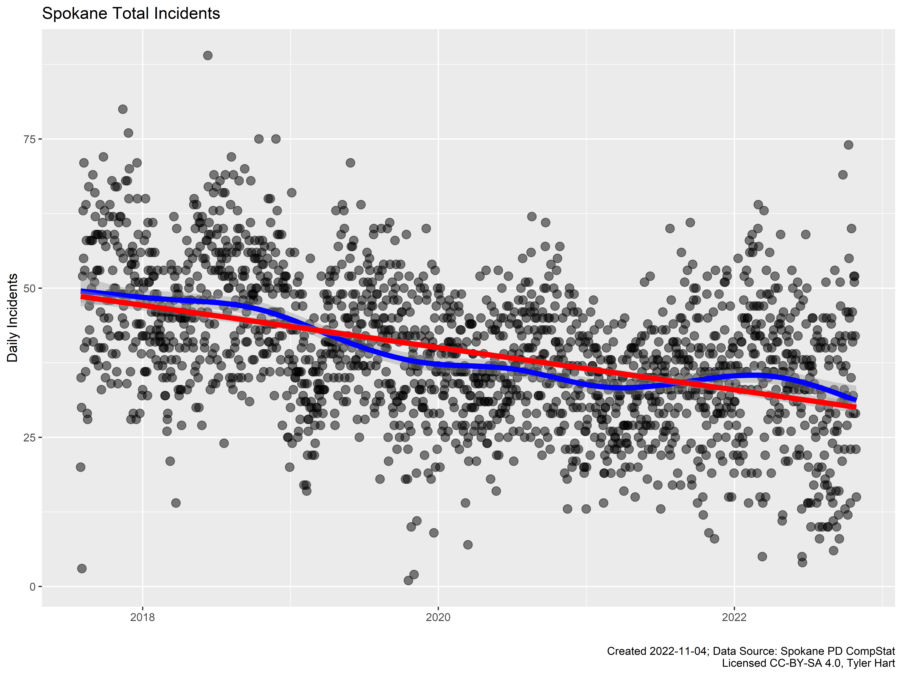

We have data for full years beginning in 2018 for comparison:

The majority of crime in Spokane is non-violent, though assaults, robbery, and other violent crimes do occur with some regularity:

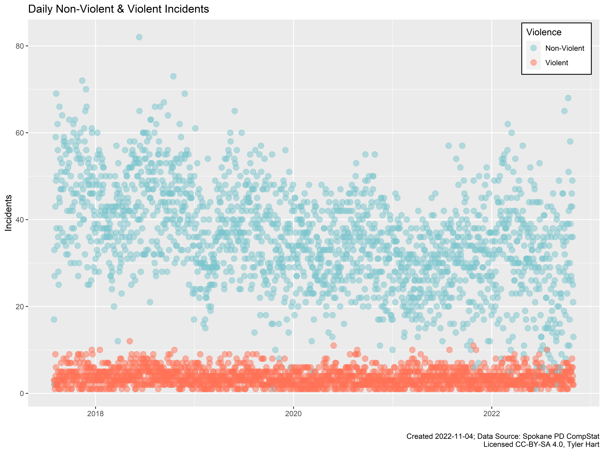

We can also look at the same information, but split up by policing districts:

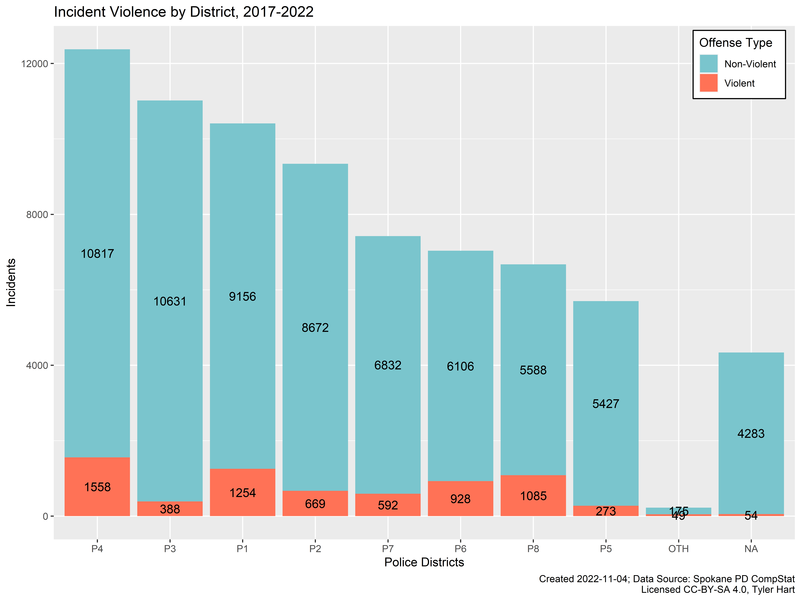

Of non-violent crimes, theft is the most common. This includes shoplifting, burglary (residential and commercial), and motor vehicle thefts.

## Seasonality

When we're looking at events as they happen over time we must consider [*seasonality*](https://en.wikipedia.org/wiki/Seasonality). Crime in Spokane definitely follows seasonal trends occurring throughout the year. We can use this seasonality to make predictions and give context to increases or decreases in crime. Data that follows a seasonal trend can be broken down ("decomposed") into its consituent parts. Here's a decomposition of overall crime data:

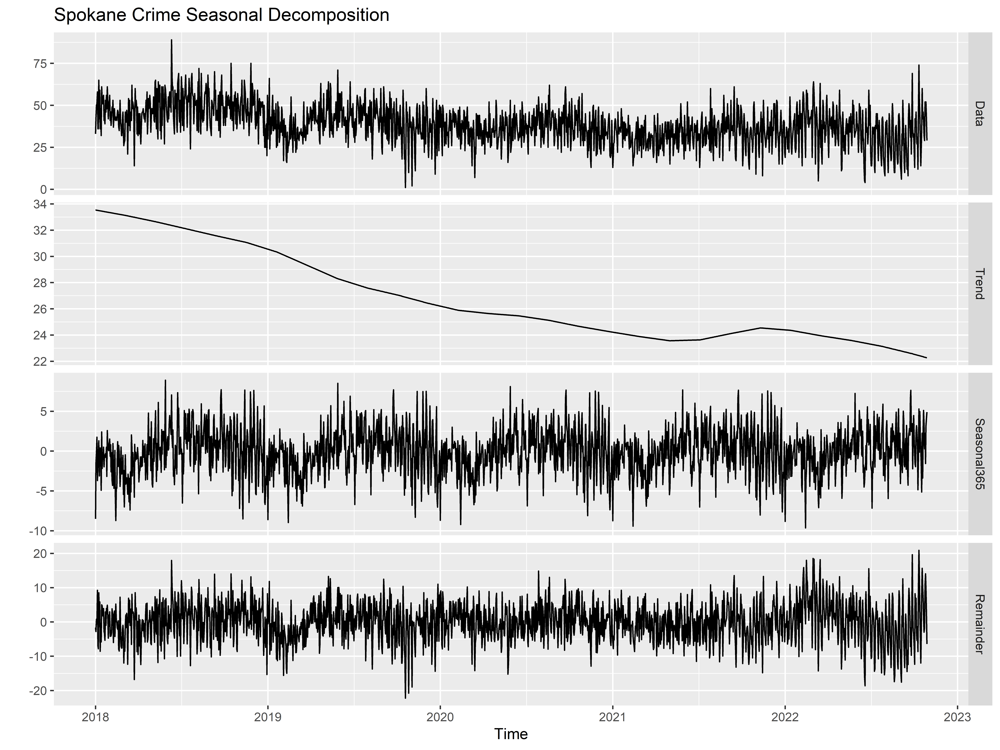

The "seasonal" section of the plot above shows an obvious, repeating cycle that occurs each year. There's also a downward trend line. Once we've identified seasonal cycles it's possible to visualize what crime is doing independent of the expected change:

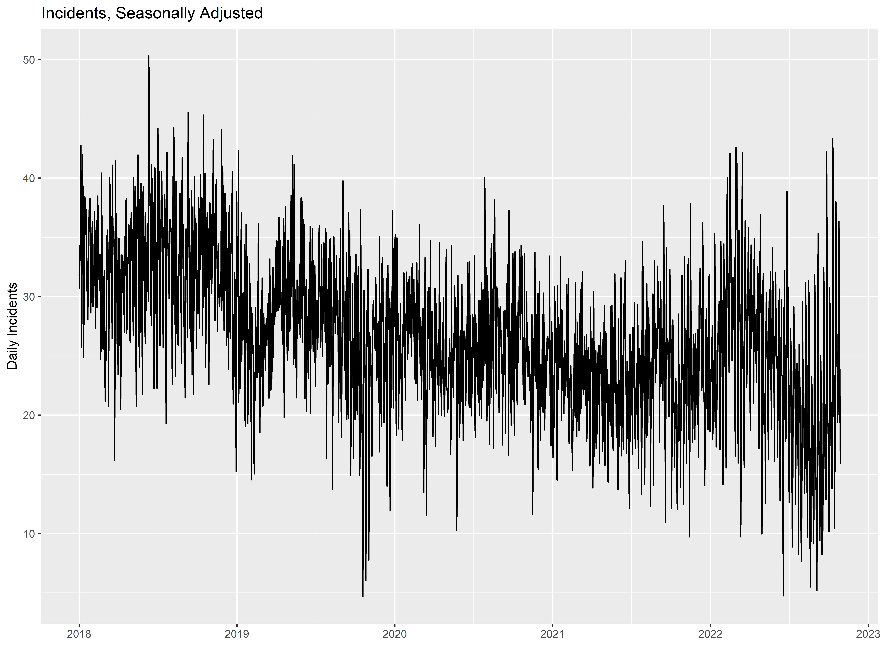

We can do the same thing for offense categories - in this case Burglary:

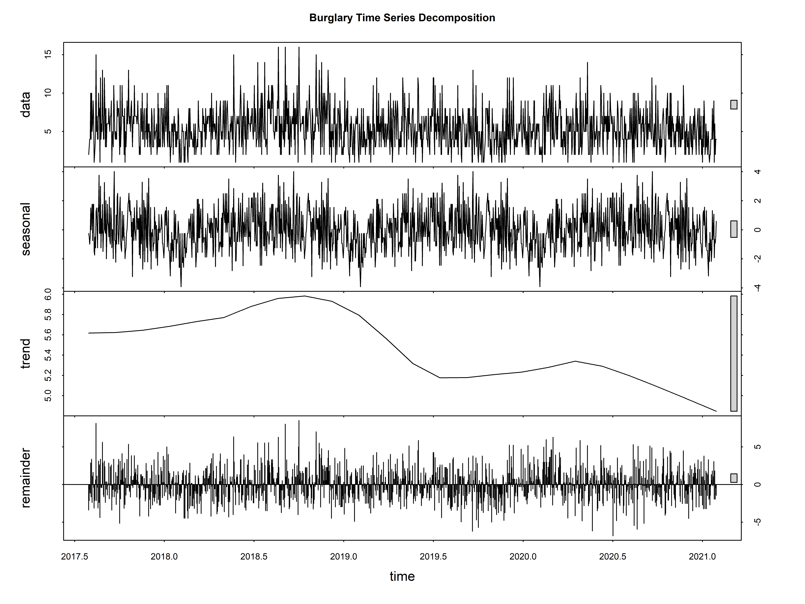

Here's a visualization of seasonally-adjusted burglaries:

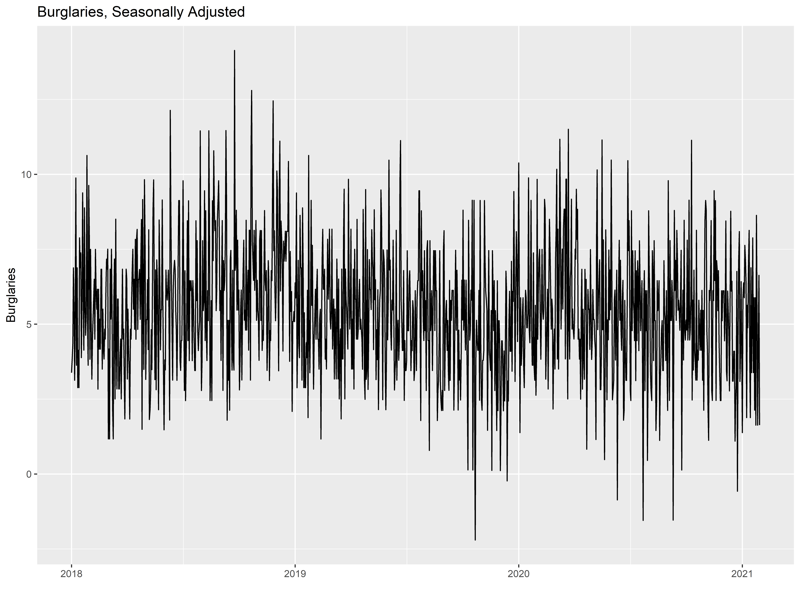

## Police District Statistics

The city is divided among eight policing districts, with four (P1, P2, P3, P4) in the "North Police Service Area" and the other four (P5, P6, P7, P8) in the "South". The north and south service areas are separated geographically by the Spokane River. Some offenses are noted as occurring in an "OTH" district with no amplifying information given. Rarely, an offense will also be listed with no district at all in the weekly reports, possibly due to a data entry error. Districts designated "SPA", "SPB", "SPC", and "SPD" had been used in the past, but no information is given in the CompStat reports indicating what areas these designations represented. "OTH" and unknown (empty) districts are omitted from the figures below.

So far in 2021, most crime occurred in districts P1, P2, P3, and P4 - all north of the Spokane River. Districts P4 and P2 have the highest overall counts:

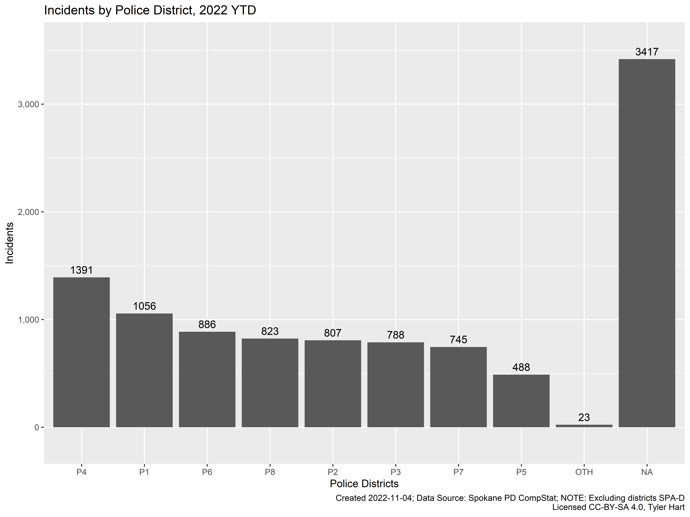

Districts P1-4 have the highest overall counts of reported crimes from September 2017 onward:

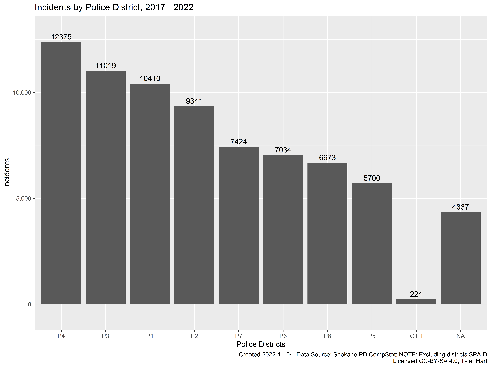

## Types of Offenses

General theft (or larceny), burglary, and theft of motor vehicles continue to be top reported crimes so far in 2021:

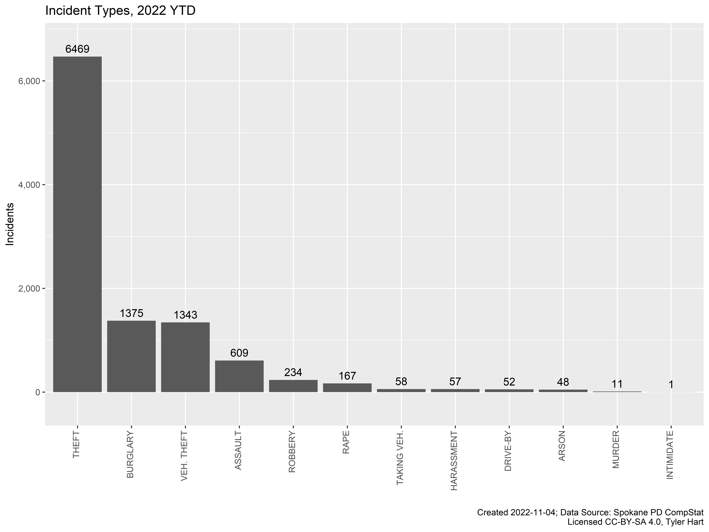

This follows the trend that's been recorded since mid-2017:

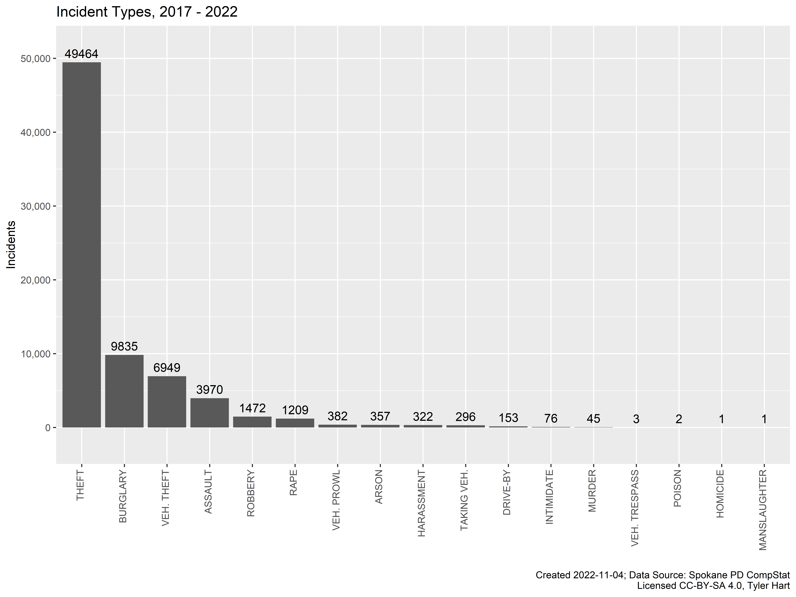

## Month-Over-Month Statistics

While looking at data week-over-week is often not useful due to how "jumpy" crime statistics can be, month-over-month data can tell a story. Any field in the tables with "NA" value indicates that data either was not or is not yet available.

1. [Non-Violent Crime](#non-violent-crime)
1. [Violent Crime](#violent-crime)

### Non-Violent Crime

Most crime in Spokane is "non-violent", including theft and burglary.

### Violent Crime

Violent crime includes assault, sexual assault, robbery, intimidation with a weapon, and carjacking:

## Lunar Phases

Despite popular sayings like, "must be a full moon out, people are being crazy!", the moon's phase has no noticable affect on crime in Spokane. In fact, crime has been lowest in the last few years when the Moon is full:

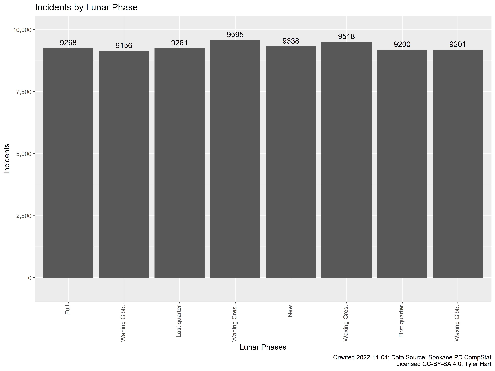

There is no significant difference in the amount of offenses between lunar phases.

## Data Sources

There are many public resources that we leverage for data analysis. All are open and available to the public, though not always easy to find. Our data sources include the following:

1. [City of Spokane COMPSTAT reports](https://my.spokanecity.org/police/prevention/compstat/)
1. [City of Spokane OpenData GIS portal](https://my.spokanecity.org/opendata/gis/)
1. [Spokane County ArcGIS portal](https://gisdatacatalog-spokanecounty.opendata.arcgis.com/)
1. [HealthData.gov](https://healthdata.gov/)
1. [FBI's Uniform Crime Reporting (UCR) Statistics Tool](https://www.ucrdatatool.gov/)
1. [U.S. Bureau of Labor Statistics Data Tools](https://data.bls.gov/timeseries/LNS14000000)
1. [FBI's Crime Data Explorer (CDE)](https://crime-data-explorer.fr.cloud.gov/downloads-and-docs)
1. [Spokane County 911 Communications Annual Reports](https://www.spokanecounty.org/Archive.aspx?AMID=36)

## Data Limitations

There are limitations to the analysis that's possible using CompStat data provided by the city. While detailed information about Spokane crime does eventually get reported in the [FBI's NBIRS program](https://crime-data-explorer.fr.cloud.gov/downloads-and-docs), there is often a year's lag or more before the public can download it. For example, 2018's data was made available in September 2019. As of May 2021, only data from 2019 is available. It will likely be late-2022 or sometime in 2023 before 2021's data can be downloaded and analyzed. In the meantime, we only have the less-detailed CompStat data to work with. More in-depth analysis of the detailed FBI data will become a separate project when I have time.

### Final Offenses

It should be noted that the weekly CompStat data may not accurately reflect the final offense someone is charged with. For example, simple assault may become homicide if the victim later dies from their injuries. Shoplifting could become "Retail Theft With Special Circumstances" if it's found the offender was part of a larger shoplifing ring. **CompStat reports are not retroactively updated to reflect the final disposition of an offense.** With that being said, there is more than enough data to identify trends over time and make predictions.

### Locations

In the SPD's CompStat data, locations of sexual assault offenses are not included in order to protect the victim's privacy. While we know how many sexual assaults are reported and the general policing district that they occurred, it's not possible to correlate that type of assault with specific locations. When locations are included in weekly CompStat reports, they are sometimes documented only as an intersection of two roads, with no street numbers or direction. If an address is included in CompStat data, the street number is rounded - a robbery at "1215 E. Main Street" may become "1200 E. Main Street". Sometimes low-numbered locations are documented as "0 E. Main Street". This makes density or "heat" mapping difficult, and the resulting graphics unreliable.

### Legal Nuance

There are some distinctions made in the data provided by SPD, and these reflect the definition of certain offenses in the state of Washington. For example, while purse snatching is robbery in that property is being taken from somebody in-person, it's not the same as being robbed at gunpoint or carjacked. Ideally the perpetrator grabs the purse and flees, without brandishing a weapon or harming the victim otherwise. In the raw data, there are a number of offenses listed as "ROBBERY 2D PERSON (NOT PURSE SNATCHING)". So while the victim's purse was taken in-person, we won't see it listed as a robbery. This is not so much a shortcoming of the data as it's a nuanced legal distinction. It's not made clear in CompStat reports exactly how offenses are defined and categorised.

### Missing Data

We're missing some data not due to legal details, but because many crimes go unreported. This occurs for a number of reasons depending on the community - social pressures, past negative encounters with law enforcement, prior criminal history of potential reporters, etc. It would be naive to think that all crime committed in Spokane is reported and subsequently documented in the CompStat reports. Assumptions about the percentage of crimes that go unreported depend on complex, interconnected variables that change over time. It'd take a background in statistics, sociology, and criminal justice that I just don't have to develop solid conclusions. For that reason, this project only focuses on analysis and reporting with the data at-hand, without making assumptions about unreported crimes.

### Reporting Changes

Spokane's reporting of crime data has also undergone multiple transformations in the last decade. CompStat data is available on the SpokaneCity.org portal from 2019 all the way back to 2015. On October 4, 2016 the SPD moved from one crime reporting standard ([UCR](https://www.ucrdatatool.gov/)) to another ([NIBRS](https://www.fbi.gov/services/cjis/ucr/nibrs)). Current CompStat reports state on the first page about the switchover date,

> Numbers on CompStat reports prior to this date should not be used as a comparison to those on this report.

Unfortunately, we're not able to make true "apples-to-apples" comparisons across the full timespan of availalble CompStat crime data. Some years also have missing weeks of reports, and it's unclear if that data will ever be available.

## Violence and Crime Classifications

In some of the analysis I've made distinctions between violent and non-violent crimes. For the purposes of this project, violent crimes include assault, homicide, robbery, rape, and murder. While this isn't an exhaustive list of all possible violent crime on the books in our state, it fits the data provided by SPD. Each week when new data is processed I verify that every offense is parsed and categorized properly. If additional types of violent crime are committed and reported in the data I'll add them to the list and they'll become part of the classification process.

## Contact

Thanks for your interest in the project. If you have questions, comments, or press inquiries feel free to email tyler[at]manitonetworks.com.
