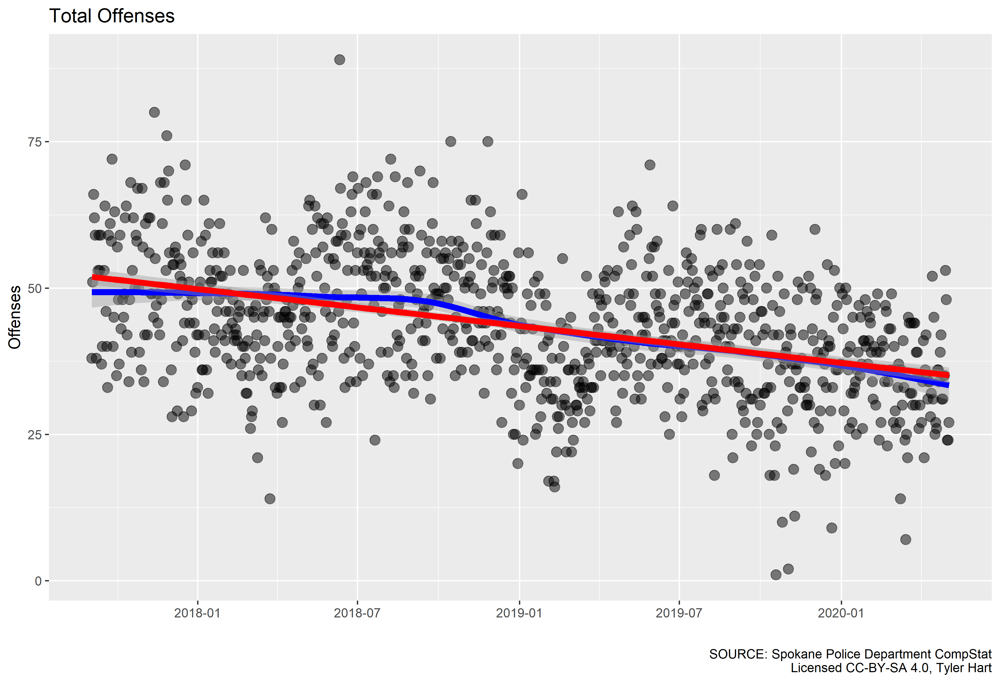

# Spokane Crime Analysis Project

Spokane Crime Analysis Project (CAP) is dedicated to discovering, analyzing, and visualizing crime data in Spokane, WA. Informed residents can make better decisions about where to live, raise families, work, and play in our wonderful city with up-to-date information on crime. With data in-hand, residents can engage actively and factually with local leaders and law enforcement.

1. [Ongoing Analysis](#ongoing-analysis)
1. [Static Analysis](#static-analysis)
1. [Goals](#goals)
1. [Data Sources](#data-sources)
1. [Contact](#contact)

Please take a moment to read through the sections below before diving into the data.

## Ongoing Analysis

Crime never stops, unfortunately. To keep track of trends over time we have ongoing [analysis running on a weekly basis](/weekly_watch/). These track fairly close with data published regularly by the City of Spokane and the County. Most people are interested in the overall trend of crime over time - the "big picture". Using the COMPSTAT reports made available by the city we put a plot together of daily offenses post-September 12, 2017:

Dashed vertical lines show the beginning and end of summer, which appears to correspond with a rise in crime. Two additional lines (red and blue), show smoothed averages using linear and LOESS methods, respectively. As more weekly COMPSTAT reports are released and incorporated into the analysis our view over time will improve.

## Static Analysis

We periodically look backward in time with data that won't be updated again. Despite the data being somewhat "stale" it can still give us insight and help frame the conversation around what's happening today. It's not always as clean and tidy as newer data, but it's still useful after some wrangling. 

1. [WA State NIBRS Trends](/wa_state_nibrs/)
1. [FBI Crime and Population Data (UCR, 1985-2014)](/fbi_ucr/annual_report/)

## Goals

The Crime Analysis Project works to meet these goals for the local community:

1. Identify and visualize long-term crime trends
1. Discover associations between crime and social, natural, and economic conditions
1. Make meaningful comparisons with cities across the nation
1. Leverage data from diverse, trusted sources
1. Be honest and open in the use of statistics, models, estimates, and assumptions
1. Publish objective, independent reports and analysis

## Data Sources

There are many public resources that we leverage for data analysis. All are open and available to the public, though not always easy to find. Our data sources include the following:

1. [City of Spokane COMPSTAT reports](https://my.spokanecity.org/police/prevention/compstat/)
1. [City of Spokane OpenData GIS portal](https://my.spokanecity.org/opendata/gis/)
1. [Spokane County ArcGIS portal](https://gisdatacatalog-spokanecounty.opendata.arcgis.com/)
1. [HealthData.gov](https://healthdata.gov/)
1. [FBI's Uniform Crime Reporting (UCR) Statistics Tool](https://www.ucrdatatool.gov/)
1. [U.S. Bureau of Labor Statistics Data Tools](https://data.bls.gov/timeseries/LNS14000000)
1. [FBI's Crime Data Explorer (CDE)](https://crime-data-explorer.fr.cloud.gov/downloads-and-docs)
1. [Spokane County 911 Communications Annual Reports](https://www.spokanecounty.org/Archive.aspx?AMID=36)

## Contact

Thanks for your interest in the project. If you have questions, comments, or press inquiries feel free to email tyler[at]manitonetworks.com.
