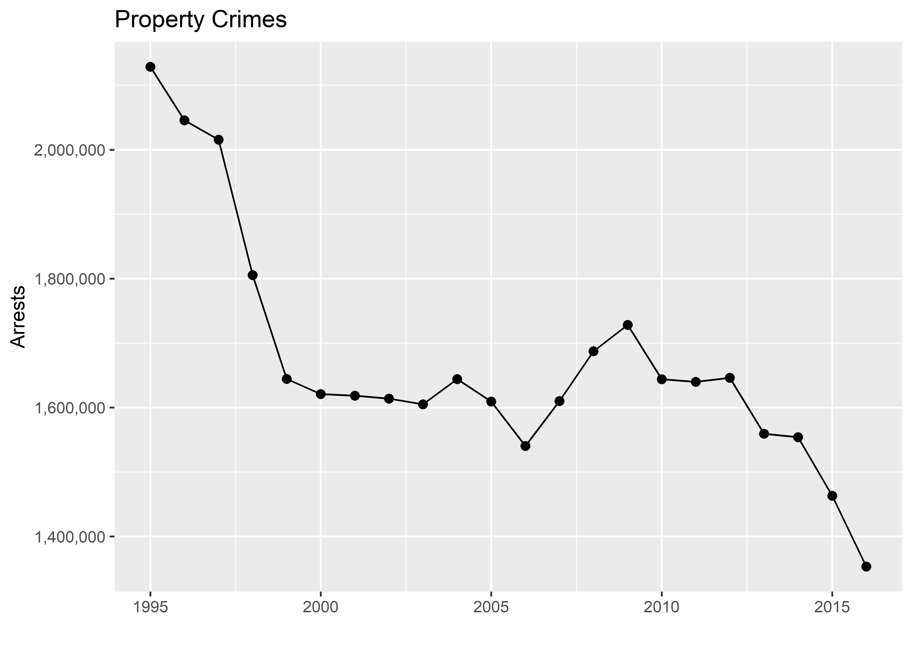
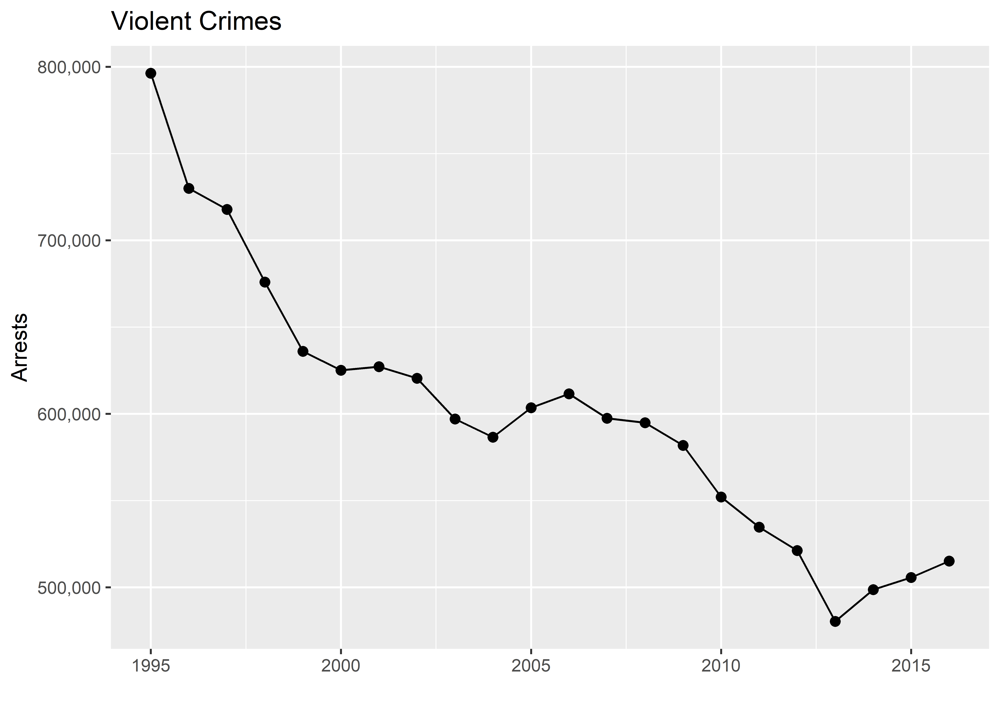
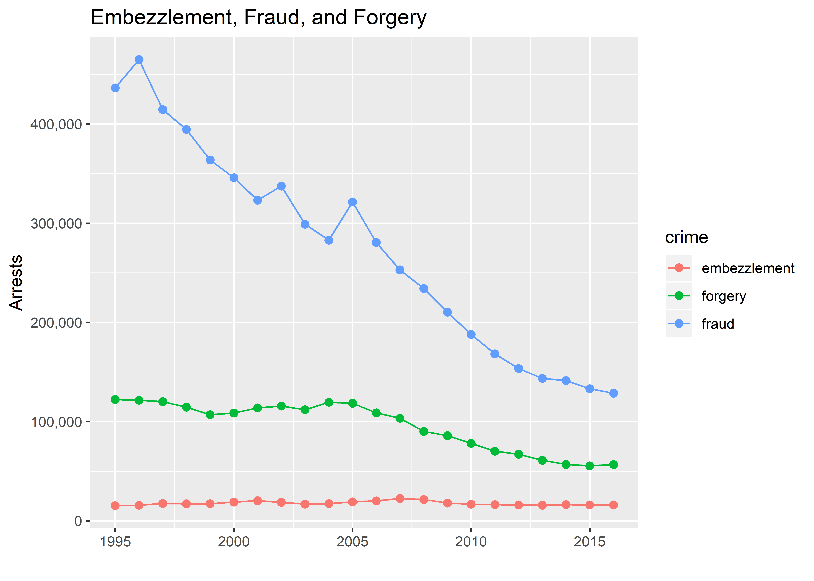
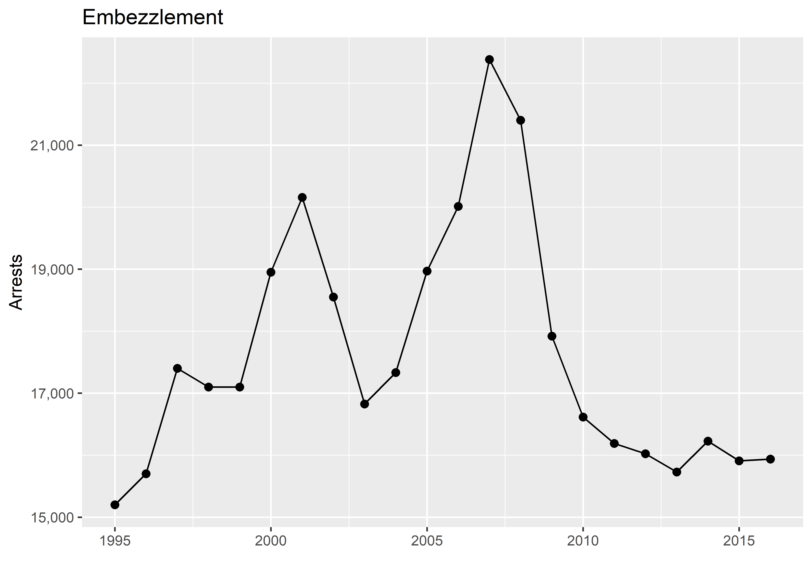
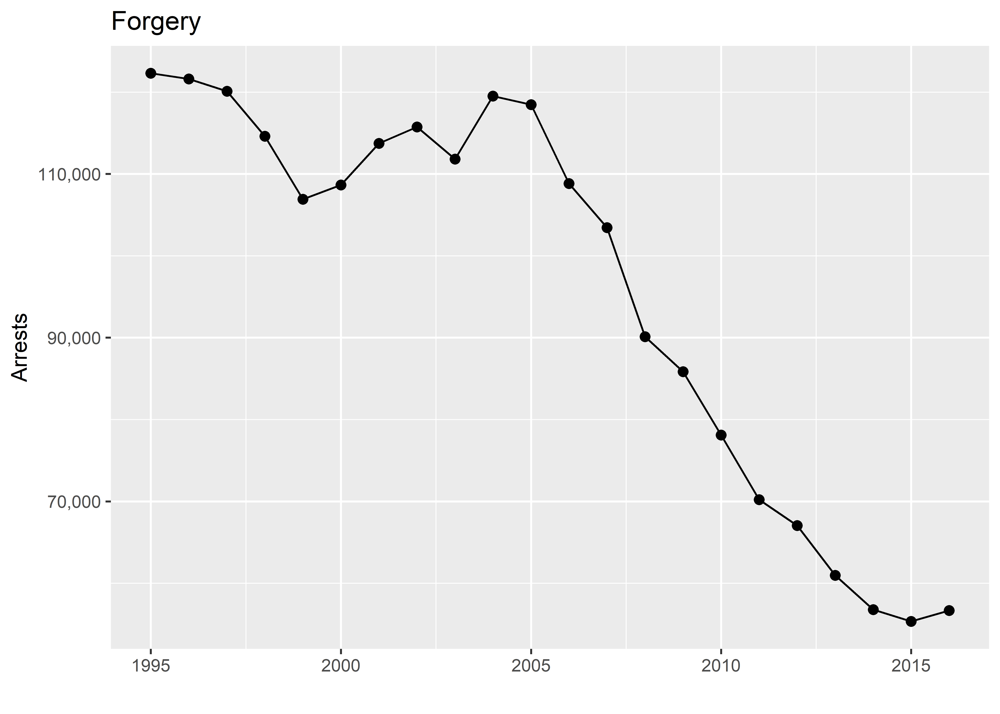
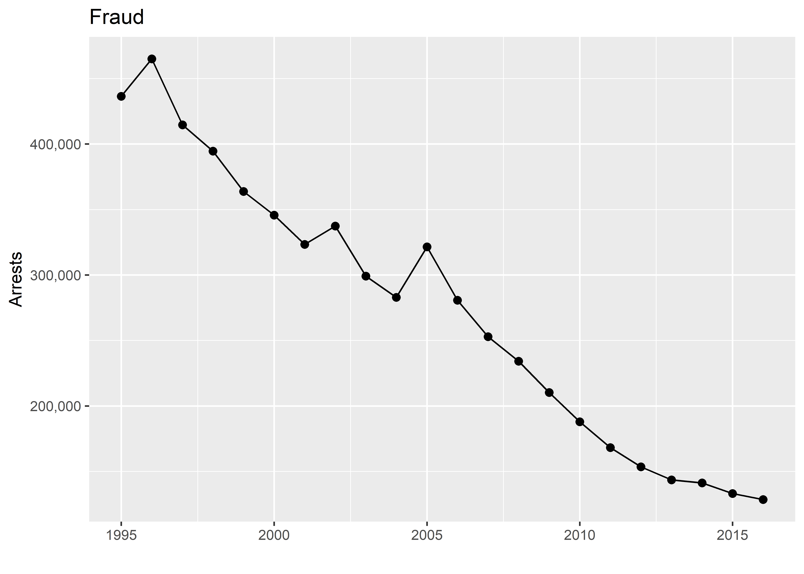
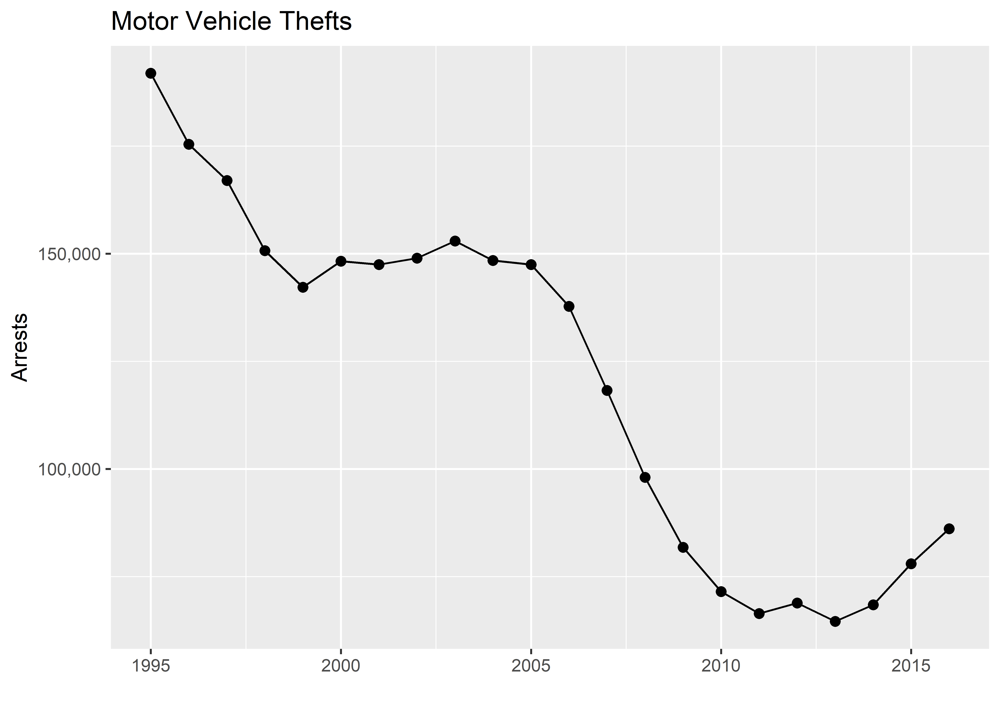
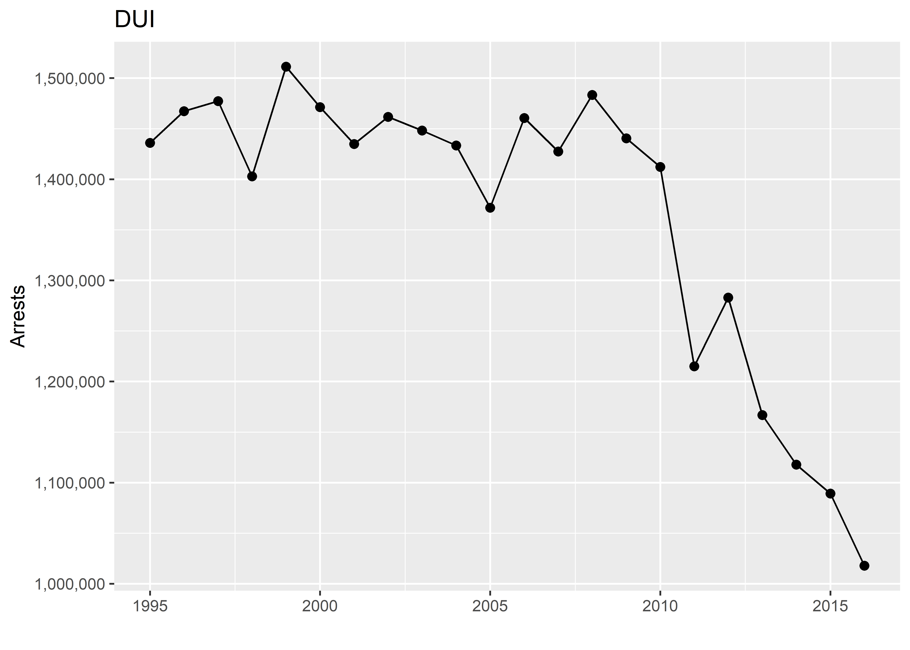
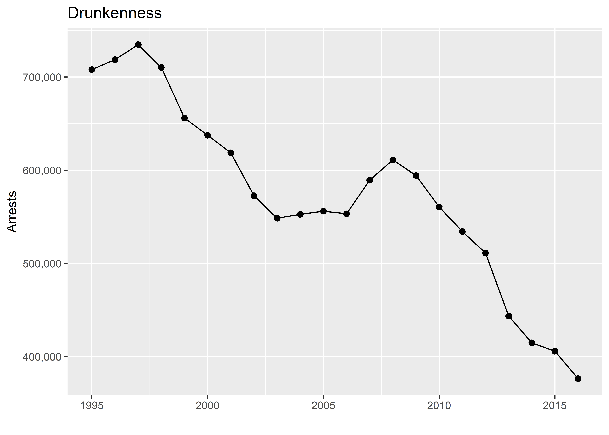

---
output:
  html_document: default
  pdf_document: default
---
# National Arrests (1995-2016)

This project provides analysis and visualization of national arrest trends from 1995-2016. Data is provided by the United States Federal Bureau of Investigation (FBI). We visualize the following types of crime:

1. [Property Crimes](#property-crimes)
1. [Violent Crimes](#violent-crimes)
1. [White Collar](#white-collar-crime)
1. [Motor Vehicle Thefts](#motor-vehicle-thefts)
1. [Alcohol-Related Crimes](#alcohol-related-crimes)

## Property Crimes

Overall property crimes:

## Violent Crimes

Overall violent crimes:

## White Collar Crime

So-called “white collar” crimes, including embezzlement, forgery, and fraud:

## Motor Vehicle Thefts

## Alcohol-Related Crimes

Alcohol-related crimes, including DUI and drunkenness:

