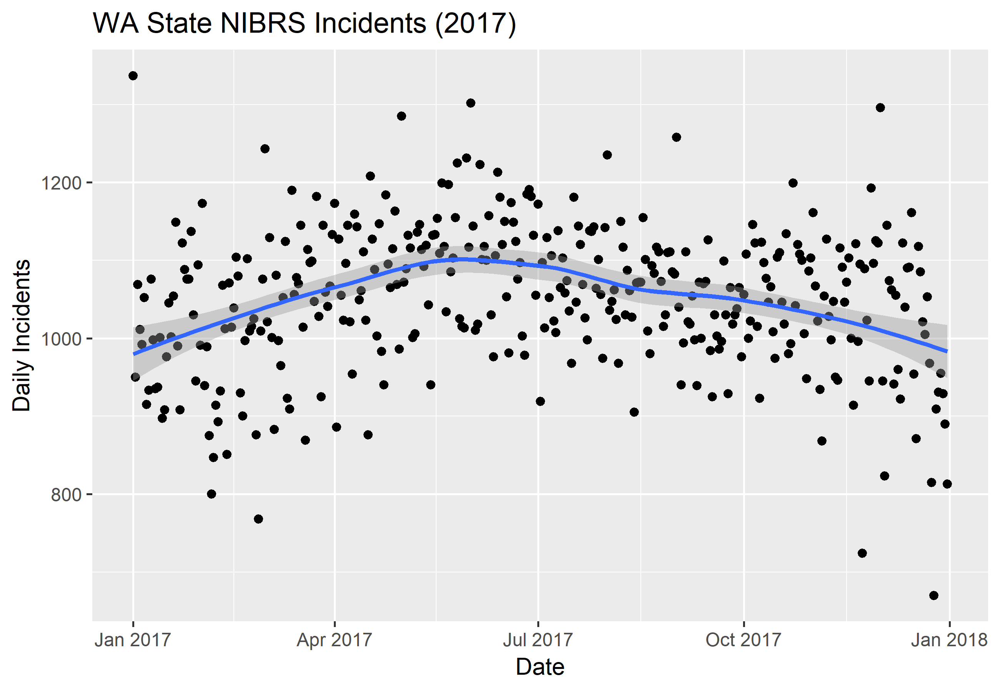
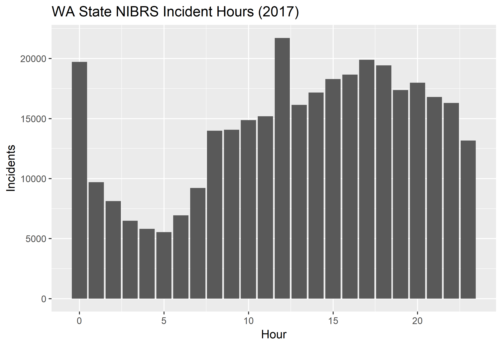

# Washington State NIBRS Trends

Analysis of NIBRS data for Washington State provided by the FBI. The state was [certified to begin submitting NIBRS data in 2006](https://www.google.com/url?sa=t&rct=j&q=&esrc=s&source=web&cd=3&cad=rja&uact=8&ved=2ahUKEwjMy5TOourhAhWhMHwKHUyYBYwQFjACegQIBBAC&url=https%3A%2F%2Fwww.waspc.org%2Fassets%2FCJIS%2Ftrainingmanualsandreference%2Fnibrsexecutivesummary.pdf&usg=AOvVaw1RYUa2rlai1Z9wB6ILFpd3), with a goal of full conversion for all agencies by early 2012. However, given the number of agencies and record management systems there were delays. When comparing NIBRS incidents from prior to 2017, the steady upward trend appears to reflect the increasing amount of agencies reporting to NIBRS and not the real count of incidents. Once all agencies are reporting to NIBRS we'll be able to do an apples-to-apples comparison of incidents from year-to-year. Currently, our analysis focuses on data from 2017 and beyond as it becomes available.

Data downloads are available from the FBI at the following URL:

https://crime-data-explorer.fr.cloud.gov/downloads-and-docs

## 2017 Trends

Here are plots showing overall incidents by day throughout 2017 and by the hour:

Incidents peak mid-year, then taper off until year-end. On average, the "quiet" time for incidents is about 0500 (5:00am) on a daily basis. Incidents rise sharply around noon, then settle again before increasing gradually until about 1700 (5:00pm). Another peak occurs again about midnight, then falls off sharply until the daily low around 0500.