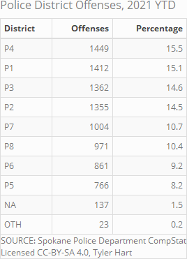

```{r setup, echo=FALSE, warning=FALSE, message=FALSE}
library(tidyverse)
library(ggrepel)
library(forecast)
library(tseries)
library(stringr)
library(data.table)
library(scales)
library(lunar)
library(kableExtra)
library(magick)
library(webshot)
library(dygraphs)
library(knitr)
knitr::opts_chunk$set(
  echo = FALSE, 
  message = FALSE,
  warning = FALSE,
  collapse = TRUE,
  results = 'asis',
  fig.align = 'center',
  fig.pos = 'ht',
  dpi = 400,
  fig.path='./figures/',
  dev=c('svg','png'),
  out.width='\\textwidth'
  )
library(kableExtra)
library(lubridate)

source("./text_import.R") # Build crime data frame
#source("./categorize_offenses.R") # Categorize offense names
source("./categorize_violence.R") # Categorize violent / non-violent
source("./lunar_seasons.R") # Lunar phase, seasons

# GGPlot geometry options
point_alpha = 0.5
point_size = 3
geom_line_size = 2

### Figure captions ###
data_source_str <- paste(paste("Created",Sys.Date(), sep = " "),"Data Source: Spokane Police Department CompStat", sep = "; ")
cc_by_sa <- "Licensed CC-BY-SA 4.0, Tyler Hart"
excluded_districts_note <- "NOTE: Excluding districts OTH, NA, SPA-D"
boilerplate_caption <- paste(data_source_str, cc_by_sa, sep = "\n")
boilerplate_caption_exclude_dist <- paste(paste(data_source_str, excluded_districts_note, sep = "; "), cc_by_sa, sep = "\n")

### Abbrev. offense names ###
levels(df.crimes$offense)[levels(df.crimes$offense)=="THEFT OF MOTOR VEHICLE"] <- "VEH. THEFT"
levels(df.crimes$offense)[levels(df.crimes$offense)=="TAKING MOTOR VEHICLE"] <- "TAKING VEH."
levels(df.crimes$offense)[levels(df.crimes$offense)=="VEHICLE PROWLING"] <- "VEH. PROWL"
levels(df.crimes$offense)[levels(df.crimes$offense)=="DRIVE BY SHOOTING"] <- "DRIVE-BY"
levels(df.crimes$offense)[levels(df.crimes$offense)=="VEHICLE TRESPASS"] <- "VEH. TRESPASS"

### Moon phase abbreviations ###
levels(df.crimes$lunar_phase)[levels(df.crimes$lunar_phase)=="Waning gibbous"] <- "Waning Gibb."
levels(df.crimes$lunar_phase)[levels(df.crimes$lunar_phase)=="Waning crescent"] <- "Waning Cres."
levels(df.crimes$lunar_phase)[levels(df.crimes$lunar_phase)=="Waxing crescent"] <- "Waxing Cres."
levels(df.crimes$lunar_phase)[levels(df.crimes$lunar_phase)=="Waxing gibbous"] <- "Waxing Gibb."

### Prune old / incomplete data ###
df.crimes <- df.crimes %>%
  filter(date >= "2017-08-01")

### Summarized daily offenses ###
daily_offenses <- df.crimes %>%
  group_by(date) %>%
  summarize(offenses = n())

daily_offenses_violence <- df.crimes %>%
  group_by(date, violence) %>%
  summarize(offenses = n())

# Summarized daily offenses by month
summarized_crimes <- df.crimes %>%
  group_by(year, num.month, num.day) %>%
  summarize(daily_offenses = n()) %>%
  group_by(year, num.month) %>%
  summarize(
    avg.daily_offenses = mean(daily_offenses), 
    sum.monthly_offenses = sum(daily_offenses)
    )

summarized_crimes$date <- with(summarized_crimes, paste(year, num.month, "01" ,sep="-"))
summarized_crimes$date <- as.Date(summarized_crimes$date, format = "%Y-%m-%d")
summarized_crimes <- subset(summarized_crimes, select = c(date, avg.daily_offenses, sum.monthly_offenses))

### Data for Modeling ###
model_data <- df.crimes %>%
  group_by(date) %>%
  summarize(offenses = n())

# Modeling start, end numerical dates
start_date <- as.numeric(as.Date("2017-08-01") - as.Date("2017-01-01")) # First 2017 observed date
end_date <- as.numeric(max(model_data$date) - as.Date("2020-01-01")) # Last 2020 observed date
freq <- 365 # Time series frequency

# Time series data
ts.crimes <- ts(model_data, start = c(2017,start_date), end = c(2020,end_date), frequency = freq)
```

# Total Offenses

```{r plot.offenses_over_time, fig.pos="H", fig.width=10, fig.height=7.5}
daily_offenses %>%
  ggplot(aes(date, offenses)) + 
  geom_point(size = point_size, alpha = point_alpha) +
  geom_smooth(method = "auto", color = "blue", size = geom_line_size) +
  geom_smooth(method = "lm", color = "red", size = geom_line_size) +
  labs(
    x = "", 
    y = "Offenses", 
    title = "Total Offenses", 
    caption = paste(data_source_str, cc_by_sa, sep = "\n")
    )
```

```{r plot.crime_time_series_decomposition, fig.pos="H", fig.width=10, fig.height=7.5}
# Decompose, plot time series
ts.crime_stl <- stl(ts.crimes[,2],"periodic", robust = TRUE)
plot(ts.crime_stl, main = "Crime Seasonal Decomposition")
```

```{r plot.crime_seasonally_adjusted, fig.pos="H", fig.width=10, fig.height=7.5}
# Decompose time series
ts.crime_stl <- stl(ts.crimes[,2],"periodic", robust = TRUE) # Decompose time series
ts.crime_sa <- seasadj(ts.crime_stl) # Adjust for seasonality
plot(ts.crime_sa, main = "Offenses, Seasonally Adjusted", xlab = "", ylab = "Offenses")
```

```{r plot.offenses_over_time_violence, fig.pos="H", fig.width=10, fig.height=7.5}
daily_offenses_violence %>%
  ggplot(aes(date, offenses)) + 
  geom_point(aes(color = violence), size = point_size, alpha = point_alpha) +
  scale_color_manual(values = c("cadetblue3","coral1")) +
  labs(
    x = "", 
    y = "Offenses", 
    color = "Violence",
    title = "Daily Non-Violent & Violent Offenses", 
    caption = paste(data_source_str, cc_by_sa, sep = "\n")
    )
```

```{r plot.offenses_over_time_violence_wrap, fig.pos="H", fig.width=10, fig.height=7.5}
daily_offenses_violence %>%
  ggplot(aes(date, offenses)) + 
  geom_point(size = point_size, alpha = point_alpha) +
  geom_smooth(method = "auto", color = "blue", size = geom_line_size) +
  geom_smooth(method = "lm", color = "red", size = geom_line_size) +
  facet_wrap( ~ violence, ncol = 1, scales = "free") +
  labs(
    x = "", 
    y = "Offenses", 
    color = "Violence",
    title = "Daily Non-Violent & Violent Offenses", 
    caption = paste(data_source_str, cc_by_sa, sep = "\n")
    )
```

```{r plot.violent_offenses_over_time, fig.pos="H", fig.width=10, fig.height=7.5}
daily_offenses_violence %>%
  filter(violence == "Violent")  %>%
  ggplot(aes(date, offenses)) + 
  geom_point(size = point_size, alpha = point_alpha) +
  geom_smooth(method = "auto", color = "blue", size = geom_line_size) +
  geom_smooth(method = "lm", color = "red", size = geom_line_size) +
  labs(
    x = "", 
    y = "Offenses", 
    title = "Daily Violent Offenses", 
    caption = paste(data_source_str, cc_by_sa, sep = "\n")
    )
```

```{r plot.non_violent_offenses_over_time, fig.pos="H", fig.width=10, fig.height=7.5}
daily_offenses_violence %>%
  filter(violence == "Non-Violent")  %>%
  ggplot(aes(date, offenses)) + 
  geom_point(size = point_size, alpha = point_alpha) +
  geom_smooth(method = "auto", color = "blue", size = geom_line_size) +
  geom_smooth(method = "lm", color = "red", size = geom_line_size) +
  labs(
    x = "", 
    y = "Offenses", 
    title = "Daily Non-Violent Offenses", 
    caption = paste(data_source_str, cc_by_sa, sep = "\n")
    )
```

```{r plot.offenses_over_time_pred, fig.pos="H", fig.width=10, fig.height=7.5}
daily_offenses %>%
  ggplot(aes(date, offenses)) + 
  geom_point(size = point_size, alpha = point_alpha) +
  geom_smooth(method = "loess", color = "blue", size = geom_line_size) +
  geom_smooth(method = "lm", color = "red", fullrange = TRUE, size = geom_line_size) +
  scale_x_date(limits = as.Date(c("2017-09-03","2022-01-01")), date_breaks = "1 year", date_labels = "%Y") +
  labs(
    x = "", 
    y = "Offenses", 
    title = "Linear Mean Projection, Average Daily Offenses (CI 0.95)",
    caption = paste(data_source_str, cc_by_sa, sep = "\n")
    )
```

```{r plot.monthly_offense_totals, fig.width=10, fig.height=7.5}
summarized_crimes %>%
  ggplot(aes(date, sum.monthly_offenses, label = sum.monthly_offenses)) +
  geom_smooth(size = geom_line_size) +
  geom_point(size = point_size, alpha = point_alpha) +
  geom_text_repel() +
  labs(
  x = "",
  y = "Offenses",
  title = "Total Monthly Offenses",
  caption = boilerplate_caption
  ) +
  expand_limits(y = 0) +
theme(axis.text.x = element_text(angle = 90, vjust = 0.5, hjust=1))
```

```{r plot.avg_daily_offenses_by_month, fig.pos="H", fig.width=10, fig.height=7.5}
summarized_crimes %>%
  ggplot(aes(date, avg.daily_offenses, label = round(avg.daily_offenses))) +
  geom_smooth(size = geom_line_size) +
  geom_point(size = point_size, alpha = point_alpha) +
  geom_text_repel() +
  labs(
  x = "",
  y = "Avg. Daily Offenses",
  title = "Average Daily Offenses by Month",
  caption = boilerplate_caption
  ) +
  expand_limits(y = 0) +
theme(axis.text.x = element_text(angle = 90, vjust = 0.5, hjust=1))
```

```{r plot.boxplot_avg_daily_by_month, fig.width=10, fig.height=7.5}
a <- df.crimes %>% 
  group_by(day=floor_date(date, "day")) %>%
  mutate(day.count = n()) %>%
  group_by(month=floor_date(date, "month"))

a %>% ggplot(aes(x = month)) +
  geom_boxplot(aes(y = day.count, group = month)) +
  labs(
    x = "", 
    y = "Offenses", 
    title = "Daily Offenses by Month", 
    caption = paste(data_source_str, cc_by_sa, sep = "\n")
  )
```

```{r plot.monthly_offense_comparisons, fig.pos="H", fig.width=10, fig.height=7.5}
df.crimes %>%
group_by(year,num.month) %>%
summarize(offenses = n()) %>%
ggplot(aes(num.month, offenses, color = year)) +
geom_point(size = point_size, alpha = point_alpha) +
labs(
  x = "Month",
  y = "Offenses",
  title = "Monthly Offenses",
  color = "Year",
  caption = boilerplate_caption
  ) +
theme(axis.text.x = element_text(angle = 90, vjust = 0.5, hjust=1))
```

```{r plot.weekly_offense_comparisons, fig.pos="H", fig.width=10, fig.height=7.5}
df.crimes %>%
  filter(date >= "2017-09-12") %>%
group_by(year,num.week) %>%
summarize(offenses = n()) %>%
ggplot(aes(num.week, offenses, color = year)) +
geom_point(size = point_size, alpha = point_alpha) +
labs(
  x = "Week",
  y = "Offenses",
  title = "Weekly Offenses",
  color = "Year",
  caption = boilerplate_caption
  ) +
theme(axis.text.x = element_text(angle = 90, vjust = 0.5, hjust=1))
```


```{r plot.theft_over_time, fig.pos="H", fig.width=10, fig.height=7.5}
df.crimes %>%
  filter(offense == "THEFT") %>%
  group_by(date) %>%
  summarize(offenses = n()) %>%
  ggplot(aes(date, offenses)) + 
  geom_point(size = point_size, alpha = point_alpha) +
  geom_smooth(method = "auto", color = "blue", size = geom_line_size) +
  geom_smooth(method = "lm", color = "red", size = geom_line_size) +
  scale_x_date(date_breaks = "3 months", date_labels = "%b-%Y") +
  labs(
    x = "", 
    y = "Thefts", 
    title = "Overall Thefts", 
    caption = boilerplate_caption
    ) 
```


```{r plot.shoplifting_over_time, fig.pos="H", fig.width=10, fig.height=7.5}
# df.crimes %>%
#   filter(subcategory == "Shoplifting") %>%
#   group_by(date) %>%
#   summarize(offenses = n()) %>%
#   ggplot(aes(date, offenses)) +
#   geom_point(size = point_size, alpha = point_alpha) +
#   geom_smooth(method = "auto", color = "blue", size = geom_line_size) +
#   geom_smooth(method = "lm", color = "red", size = geom_line_size) +
#   scale_x_date(date_breaks = "3 months", date_labels = "%b-%Y") +
#   labs(
#     x = "", 
#     y = "Shoplifting Thefts", 
#     title = "Shoplifting Thefts", 
#     caption = boilerplate_caption
#     )
```

```{r plot.firearm_thefts, fig.pos="H", fig.width=10, fig.height=7.5}
# df.crimes %>%
#   filter(category %in% c("THEFT") & subcategory %in% c("Firearm")) %>%
#   group_by(date) %>%
#   summarize(offenses = n()) %>%
#   ggplot(aes(date, offenses)) + 
#   geom_point(size = point_size, alpha = point_alpha) +
#   geom_smooth(method = "auto", color = "blue", size = geom_line_size) +
#   geom_smooth(method = "lm", color = "red", size = geom_line_size) +
#   scale_x_date(date_breaks = "3 months", date_labels = "%b-%Y") +
#   labs(
#     x = "", 
#     y = "Firearm Thefts", 
#     title = "Firearm Thefts", 
#     caption = boilerplate_caption
#     )
```

```{r plot.burglaries_over_time, fig.pos="H", fig.width=10, fig.height=7.5}
# df.crimes %>%
#   filter(category %in% c("BURGLARY")) %>%
#   group_by(date) %>%
#   summarize(offenses = n()) %>%
#   ggplot(aes(date, offenses)) + 
#   geom_point(size = point_size, alpha = point_alpha) +
#   geom_smooth(method = "auto", color = "blue", size = geom_line_size) +
#   geom_smooth(method = "lm", color = "red", size = geom_line_size) +
#   scale_x_date(date_breaks = "3 months", date_labels = "%b-%Y") +
#   labs(
#     x = "", 
#     y = "Burglaries", 
#     title = "Overall Burglaries", 
#     caption = boilerplate_caption
#     ) 
```

```{r plot.burglaries_seasonally_adjusted, fig.pos="H", fig.width=10, fig.height=7.5}
# Total Offenses by date
model_data <- df.crimes %>%
  filter(offense == "BURGLARY") %>%
  group_by(date) %>%
  summarize(offenses = n())

# Calculate start, end numerical dates
start_date <- as.numeric(as.Date("2017-08-01") - as.Date("2017-01-01")) # First 2017 observed date
end_date <- as.numeric(as.Date("2020-05-16") - as.Date("2020-01-01")) # Last 2020 observed date
freq <- 365 # Time series frequency

### All data time series ###
ts.crimes <- ts(model_data, start = c(2017,start_date), end = c(2020,end_date), frequency = freq)

# Decompose time series
ts.crime_stl <- stl(ts.crimes[,2],"periodic") # Decompose time series
ts.crime_sa <- seasadj(ts.crime_stl) # Adjust for seasonality
plot(ts.crime_sa, main = "Burglaries, Seasonally Adjusted", xlab = "", ylab = "Burglaries")
```

```{r plot.residential_burglaries, fig.pos="H", fig.width=10, fig.height=7.5}
# df.crimes %>%
#   filter(category %in% c("BURGLARY") & subcategory %in% c("Residential")) %>%
#   group_by(date) %>%
#   summarize(offenses = n()) %>%
#   ggplot(aes(date, offenses)) + 
#   geom_point(size = point_size, alpha = point_alpha) +
#   geom_smooth(method = "auto", color = "blue", size = geom_line_size) +
#   geom_smooth(method = "lm", color = "red", size = geom_line_size) +
#   scale_x_date(date_breaks = "3 months", date_labels = "%b-%Y") +
#   labs(
#     x = "", 
#     y = "Residential Burglaries", 
#     title = "Residential Burglaries", 
#     caption = boilerplate_caption
#     )
```

```{r plot.commercial_burglaries, fig.pos="H", fig.width=10, fig.height=7.5}
# df.crimes %>%
#   filter(category %in% c("BURGLARY") & subcategory %in% c("Commercial")) %>%
#   group_by(date) %>%
#   summarize(offenses = n()) %>%
#   ggplot(aes(date, offenses)) + 
#   geom_point(size = point_size, alpha = point_alpha) +
#   geom_smooth(method = "auto", color = "blue", size = geom_line_size) +
#   geom_smooth(method = "lm", color = "red", size = geom_line_size) +
#   scale_x_date(date_breaks = "3 months", date_labels = "%b-%Y") +
#   labs(
#     x = "", 
#     y = "Commercial Burglaries", 
#     title = "Commercial Burglaries", 
#     caption = boilerplate_caption
#     )
```

```{r plot.shoplifting_thefts, fig.pos="H", fig.width=10, fig.height=7.5}
# df.crimes %>%
#   filter(category %in% c("THEFT") & subcategory %in% c("Shoplifting")) %>%
#   group_by(date) %>%
#   summarize(offenses = n()) %>%
#   ggplot(aes(date, offenses)) + 
#   geom_point(size = point_size, alpha = point_alpha) +
#   geom_smooth(method = "auto", color = "blue", size = geom_line_size) +
#   geom_smooth(method = "lm", color = "red", size = geom_line_size) +
#   scale_x_date(date_breaks = "3 months", date_labels = "%b-%Y") +
#   labs(
#     x = "", 
#     y = "Shoplifting", 
#     title = "Shoplifting Thefts", 
#     caption = boilerplate_caption
#     )
```

```{r plot.tomv_over_time, fig.pos="H", fig.width=10, fig.height=7.5}
df.crimes %>%
  filter(offense %in% c("VEH. THEFT")) %>%
  group_by(date) %>%
  summarize(offenses = n()) %>%
  ggplot(aes(date, offenses)) + 
  geom_point(size = point_size, alpha = point_alpha) +
  geom_smooth(method = "auto", color = "blue", size = geom_line_size) +
  geom_smooth(method = "lm", color = "red", size = geom_line_size) +
  scale_x_date(date_breaks = "3 months", date_labels = "%b-%Y") +
  labs(
    x = "", 
    y = "Vehicle Thefts", 
    title = "Vehicle Thefts", 
    caption = boilerplate_caption
    )
```

```{r plot.assault_over_time, fig.pos="H", fig.width=10, fig.height=7.5}
df.crimes %>%
  filter(offense %in% c("ASSAULT")) %>%
  group_by(date) %>%
  summarize(offenses = n()) %>%
  ggplot(aes(date, offenses)) + 
  geom_point(size = point_size, alpha = point_alpha) +
  geom_smooth(method = "auto", color = "blue", size = geom_line_size) +
  geom_smooth(method = "lm", color = "red", size = geom_line_size) +
  scale_x_date(date_breaks = "3 months", date_labels = "%b-%Y") +
  labs(
    x = "", 
    y = "Assaults", 
    title = "Assaults", 
    caption = boilerplate_caption
    )
```

```{r plot.rape_over_time, fig.pos="H", fig.width=10, fig.height=7.5}
df.crimes %>%
  filter(offense %in% c("RAPE")) %>%
  group_by(date) %>%
  summarize(offenses = n()) %>%
  ggplot(aes(date, offenses)) + 
  geom_point(size = point_size, alpha = point_alpha) +
  geom_smooth(method = "auto", color = "blue", size = geom_line_size) +
  geom_smooth(method = "lm", color = "red", size = geom_line_size) +
  scale_x_date(date_breaks = "3 months", date_labels = "%b-%Y") +
  labs(
    x = "", 
    y = "Sexual Assaults", 
    title = "Sexual Assaults", 
    caption = boilerplate_caption
    ) 
```

# Police Districts

Spokane has a total of eight police districts. Those eight are divided evenly between two main groups, the North and South Police Service Areas. The Spokane River separates the two service areas, with Division St. and other major thoroughfares serving as boundaries. Districts P1 - P4 are north of the Spokane River. Districts P5 - P8 are south of the river. Some offenses in the CompStat reports are listed as "OTH", meaning "Other".

* P1: Northwest District
* P2: Central District
* P3: Neva-Wood District
* P4: Northeast District
* P5: South Central District
* P6: Southeast District
* P7: Southwest District
* P8: Downtown District
* OTH: Other District




```{r plot.ytd_offenses_by_district, fig.pos="H", fig.width=10, fig.height=7.5}
a <- df.crimes %>%
  filter(year == 2020 & !district %in% c("OTH", NA)) %>%
  group_by(district) %>%
  summarize(count = n())

ggplot(data = a, aes(reorder(district, -count), count, label = count)) +
  geom_col() +
  geom_text(vjust = -0.5) +
  geom_hline(yintercept = mean(a$count), linetype = "dotted", size = 1) +
  geom_label(aes(x = "P5", y = mean(a$count), label = round(mean(a$count), 2))) +
  labs(
    x = "Police Districts", 
    title = "Offenses by Police District, 2020 YTD", 
    caption = boilerplate_caption_exclude_dist
    ) +
  scale_y_continuous("Offenses", labels = comma, expand = c(.1, .1))
```

```{r plot.total_offenses_by_district, fig.pos="H", fig.width=10, fig.height=7.5}
a <- df.crimes %>%
  filter(!district %in% c("OTH", NA, "SPA","SPB","SPC","SPD")) %>%
  group_by(district) %>%
  summarize(count = n())

ggplot(data = a, aes(reorder(district, -count), count, label = count)) +
  geom_col() +
  geom_text(vjust = -0.5) +
  geom_hline(yintercept = mean(a$count), linetype = "dotted", size = 1) +
  geom_label(aes(x = "P5", y = mean(a$count), label = round(mean(a$count), 2))) +
  labs(
    x = "Police Districts", 
    title = "Offenses by Police District, 2017 - 2020",
    caption = boilerplate_caption_exclude_dist
    ) +
  scale_y_continuous("Offenses", labels = comma, expand = c(.1, .1))
```

```{r plot.total_offenses_by_violence_district, fig.pos="H", fig.width=10, fig.height=7.5}
a <- df.crimes %>%
  filter(!district %in% c("OTH", NA, "SPA","SPB","SPC","SPD")) %>%
  count(district, violence)
  
ggplot(a, aes(x = reorder(district, -n, sum), y = n, fill = violence, label = n)) +
  geom_col() +
  geom_text(position = position_stack(vjust = .5)) +
  scale_fill_manual("Offense Type", values = c("Non-Violent" = "cadetblue3", "Violent" = "coral1")) +
  labs(
    x = "Police Districts", 
    y = "Offenses", 
    title = "Offense Violence by District, 2017-2020", 
    caption = paste(data_source_str, cc_by_sa, sep = "\n")
    )
```

```{r plot.ytd_offenses_by_violence_district, fig.pos="H", fig.width=10, fig.height=7.5}
a <- df.crimes %>%
  filter(year == 2020 & !district %in% c("OTH", NA, "SPA","SPB","SPC","SPD")) %>%
  count(district, violence)
  
ggplot(a, aes(x = reorder(district, -n, sum), y = n, fill = violence, label = n)) +
  geom_col() +
  geom_text(position = position_stack(vjust = .5)) +
  scale_fill_manual("Offense Type", values = c("Non-Violent" = "cadetblue3", "Violent" = "coral1")) +
  labs(
    x = "Police Districts", 
    y = "Offenses", 
    title = "Offense Violence by District, 2020 YTD", 
    caption = paste(data_source_str, cc_by_sa, sep = "\n")
    )
```

## North, South Districts

```{r plot.boxplot_p1_p4_avg_daily_by_month, fig.pos="H", fig.width=10, fig.height=7.5}
a <- df.crimes %>%
  filter(!district %in% c(NA, "OTH", "P5", "P6", "P7", "P8")) %>%
  group_by(day=floor_date(date, "day")) %>%
  mutate(day.count = n()) %>%
  group_by(month=floor_date(date, "month"))

a %>% ggplot(aes(x = month)) +
  geom_boxplot(aes(y = day.count, group = month)) +
  labs(
    x = "", 
    y = "Offenses", 
    title = "North Policing Districts, Daily Offenses by Month", 
    caption = paste(data_source_str, cc_by_sa, sep = "\n")
  ) +
  facet_grid(rows = vars(district))
```

```{r plot.boxplot_p5_p8_avg_daily_by_month, fig.pos="H", fig.width=10, fig.height=7.5}
a <- df.crimes %>%
  filter(!district %in% c(NA, "OTH", "P1", "P2", "P3", "P4")) %>%
  group_by(day=floor_date(date, "day")) %>%
  mutate(day.count = n()) %>%
  group_by(month=floor_date(date, "month"))

a %>% ggplot(aes(x = month)) +
  geom_boxplot(aes(y = day.count, group = month)) +
  labs(
    x = "", 
    y = "Offenses", 
    title = "South Policing Districts, Daily Offenses by Month", 
    caption = paste(data_source_str, cc_by_sa, sep = "\n")
  ) +
  facet_grid(rows = vars(district))
```


```{r plot.ytd_offenses_by_type, fig.pos="H", fig.width=10, fig.height=7.5}
df.crimes %>%
  filter(year == 2020) %>%
  count(offense) %>%
  ggplot(aes(reorder(offense, -n), n, label = n)) +
  geom_col() +
  geom_text(vjust = -0.5) +
  theme(axis.text.x = element_text(angle = 90, vjust = 0.25, hjust=1)) +
  labs(
    x = "", 
    title = "Offense Types, 2020 YTD", 
    caption = boilerplate_caption
    ) +
  scale_y_continuous("Offenses", labels = comma, expand = c(.1, .1))
```

```{r plot.total_offenses_by_type, fig.pos="H", fig.width=10, fig.height=7.5}
df.crimes %>%
  count(offense) %>%
  ggplot(aes(reorder(offense, -n), n, label = n)) +
  geom_col() +
  geom_text(vjust = -0.5) +
  theme(axis.text.x = element_text(angle = 90, vjust = 0.25, hjust=1)) +
  labs(
    x = "", 
    title = "Offense Types, 2017 - 2020", 
    caption = boilerplate_caption
    ) +
  scale_y_continuous("Offenses", labels = comma, expand = c(.1, .1))
```

```{r plot.ytd_offenses_by_weekday, fig.pos="H", fig.width=10, fig.height=7.5}
df.crimes %>%
  filter(year == 2020) %>%
  count(dow) %>%
  ggplot(aes(fct_relevel(dow,"Monday","Tuesday","Wednesday","Thursday","Friday","Saturday","Sunday"), n, label = n)) +
  geom_col() +
  geom_text(vjust = -0.5) +
  labs(
    x = "", 
    title = "Offenses by Day, 2020 YTD", 
    caption = boilerplate_caption
    ) +
  scale_y_continuous("Offenses", labels = comma, expand = c(.1, .1))
```

```{r plot.2019_offenses_by_weekday, fig.pos="H", fig.width=10, fig.height=7.5}
df.crimes %>%
  filter(year == 2019) %>%
  count(dow) %>%
  ggplot(aes(fct_relevel(dow,"Monday","Tuesday","Wednesday","Thursday","Friday","Saturday","Sunday"), n, label = n)) +
  geom_col() +
  geom_text(vjust = -0.5) +
  labs(
    x = "", 
    title = "Offenses by Day, 2019", 
    caption = boilerplate_caption
    ) +
  scale_y_continuous("Offenses", labels = comma, expand = c(.1, .1))
```

```{r plot.2018_offenses_by_weekday, fig.pos="H", fig.width=10, fig.height=7.5}
df.crimes %>%
  filter(year == 2018) %>%
  count(dow) %>%
  ggplot(aes(fct_relevel(dow,"Monday","Tuesday","Wednesday","Thursday","Friday","Saturday","Sunday"), n, label = n)) +
  geom_col() +
  geom_text(vjust = -0.5) +
  labs(
    x = "", 
    title = "Offenses by Day, 2018", 
    caption = boilerplate_caption
    ) +
  scale_y_continuous("Offenses", labels = comma, expand = c(.1, .1))
```

```{r plot.offenses_by_lunar_phase, fig.pos="H", fig.width=10, fig.height=7.5}
df.crimes %>%
  count(lunar_phase) %>%
  ggplot(aes(fct_relevel(lunar_phase,"Full","Waning Gibb.","Last quarter","Waning Cres.","New","Waxing Cres.","First quarter","Waxing Gibb."), n, label = n)) +
  geom_col() +
  geom_text(vjust = -0.5) +
  theme(axis.text.x = element_text(angle = 90, vjust = 0.25, hjust=1)) +
  labs(
    x = "Lunar Phases", 
    title = "Offenses by Lunar Phase", 
    caption = boilerplate_caption
    ) +
  scale_y_continuous("Offenses", labels = comma, expand = c(.1, .1))
```

```{r plot.violent_offenses_by_lunar_phase, fig.pos="H", fig.width=10, fig.height=7.5}
df.crimes %>%
  filter(violence == "Violent") %>%
  count(lunar_phase) %>%
  ggplot(aes(fct_relevel(lunar_phase,"Full","Waning Gibb.","Last quarter","Waning Cres.","New","Waxing Cres.","First quarter","Waxing Gibb."), n, label = n)) +
  geom_col() +
  geom_text(vjust = -0.5) +
  theme(axis.text.x = element_text(angle = 90, vjust = 0.25, hjust=1)) +
  labs(
    x = "Lunar Phase", 
    title = "Violent Offenses by Lunar Phase", 
    caption = boilerplate_caption
    ) +
  scale_y_continuous("Offenses", labels = comma, expand = c(.1, .1))
```

# Seasonal

## Assault

```{r plot.assault_time_series_decomposition, fig.pos="H", fig.width=10, fig.height=7.5}
# Total Offenses by date
model_data <- df.crimes %>%
  filter(offense == "ASSAULT") %>%
  group_by(date) %>%
  summarize(offenses = n())

# Calculate start, end numerical dates
start_date <- as.numeric(as.Date("2017-08-01") - as.Date("2017-01-01")) # First 2017 observed date
end_date <- as.numeric(as.Date("2020-05-16") - as.Date("2020-01-01")) # Last 2020 observed date
freq <- 365 # Time series frequency

### All data time series ###
ts.crimes <- ts(model_data, start = c(2017,start_date), end = c(2020,end_date), frequency = freq)

# Decompose time series
ts.crime_stl <- stl(ts.crimes[,2],"periodic") # Decompose time series
plot(ts.crime_stl, main = "Assault Time Series Decomposition")
```

## Arson

```{r plot.arson_by_district, fig.pos="H", fig.width=10, fig.height=7.5}
a <- df.crimes %>%
  filter(offense == "ARSON") %>%
  group_by(district) %>%
  summarize(count = n())

ggplot(data = a, aes(reorder(district, -count), count, label = count)) +
  geom_col() +
  geom_text(vjust = -0.5) +
  geom_hline(yintercept = mean(a$count), linetype = "dotted", size = 1) +
  geom_label(aes(x = "P5", y = mean(a$count), label = round(mean(a$count), 2))) +
  labs(
    x = "Police Districts", 
    title = "Arson by Police District", 
    caption = boilerplate_caption_exclude_dist
    ) +
  scale_y_continuous("Offenses", labels = comma, expand = c(.1, .1))
```


## Burglary

```{r plot.boxplot_avg_daily_burglaries_by_month, fig.pos="H", fig.width=10, fig.height=7.5}
a <- df.crimes %>% 
  filter(offense == "BURGLARY") %>%
  group_by(day=floor_date(date, "day")) %>%
  mutate(day.count = n()) %>%
  group_by(month=floor_date(date, "month"))

a %>% ggplot(aes(x = month)) +
  geom_boxplot(aes(y = day.count, group = month)) +
  labs(
    x = "", 
    y = "Burglaries", 
    title = "Daily Burglaries by Month", 
    caption = paste(data_source_str, cc_by_sa, sep = "\n")
  )
```

```{r plot.burglary_time_series_decomposition, fig.pos="H", fig.width=10, fig.height=7.5}
# Total Offenses by date
model_data <- df.crimes %>%
  filter(offense == "BURGLARY") %>%
  group_by(date) %>%
  summarize(offenses = n())

# Calculate start, end numerical dates
start_date <- as.numeric(as.Date("2017-08-01") - as.Date("2017-01-01")) # First 2017 observed date
end_date <- as.numeric(as.Date("2020-05-16") - as.Date("2020-01-01")) # Last 2020 observed date
freq <- 365 # Time series frequency

### All data time series ###
ts.crimes <- ts(model_data, start = c(2017,start_date), end = c(2020,end_date), frequency = freq)

# Decompose time series
ts.crime_stl <- stl(ts.crimes[,2],"periodic") # Decompose time series
plot(ts.crime_stl, main = "Burglary Time Series Decomposition")
```

## Theft

```{r plot.boxplot_avg_daily_thefts_by_month, fig.pos="H", fig.width=10, fig.height=7.5}
a <- df.crimes %>% 
  filter(offense == "THEFT") %>%
  group_by(day=floor_date(date, "day")) %>%
  mutate(day.count = n()) %>%
  group_by(month=floor_date(date, "month"))

a %>% ggplot(aes(x = month)) +
  geom_boxplot(aes(y = day.count, group = month)) +
  labs(
    x = "", 
    y = "Thefts", 
    title = "Daily Thefts by Month", 
    caption = paste(data_source_str, cc_by_sa, sep = "\n")
  )
```

```{r plot.theft_time_series_decomposition, fig.pos="H", fig.width=10, fig.height=7.5}
# Total Offenses by date
model_data <- df.crimes %>%
  filter(offense == "THEFT") %>%
  group_by(date) %>%
  summarize(offenses = n())

# Calculate start, end numerical dates
start_date <- as.numeric(as.Date("2017-08-01") - as.Date("2017-01-01")) # First 2017 observed date
end_date <- as.numeric(as.Date("2020-05-16") - as.Date("2020-01-01")) # Last 2020 observed date
freq <- 365 # Time series frequency

### All data time series ###
ts.crimes <- ts(model_data, start = c(2017,start_date), end = c(2020,end_date), frequency = freq)

# Decompose, plot time series
ts.crime_stl <- stl(ts.crimes[,2], s.window = "periodic", robust = TRUE)
plot(ts.crime_stl, main = "Theft Time Series Decomposition")
```

```{r plot.theft_time_series_seasonal_adj, fig.pos="H", fig.width=10, fig.height=7.5}
ts.seasonal   <- ts.crime_stl$time.series[,1]
ts.trend	   <- ts.crime_stl$time.series[,2]
ts.remainder  <- ts.crime_stl$time.series[,3]
 
plot(ts.trend + ts.remainder,
main="Thefts over Time, Seasonally Adjusted",
ylab="Thefts")
```

## Robbery

```{r plot.robbery_time_series_decomposition, fig.pos="H", fig.width=10, fig.height=7.5}
# Total Offenses by date
model_data <- df.crimes %>%
  filter(offense == "ROBBERY") %>%
  group_by(date) %>%
  summarize(offenses = n())

# Calculate start, end numerical dates
start_date <- as.numeric(as.Date("2017-08-01") - as.Date("2017-01-01")) # First 2017 observed date
end_date <- as.numeric(as.Date("2020-05-16") - as.Date("2020-01-01")) # Last 2020 observed date
freq <- 365 # Time series frequency

### All data time series ###
ts.crimes <- ts(model_data, start = c(2017,start_date), end = c(2020,end_date), frequency = freq)

# Decompose time series
ts.crime_stl <- stl(ts.crimes[,2],"periodic") # Decompose time series
plot(ts.crime_stl, main = "Robbery Time Series Decomposition")
```

## Motor Vehicle Theft

```{r plot.boxplot_avg_daily_vehtheft_by_month, fig.pos="H", fig.width=10, fig.height=7.5}
a <- df.crimes %>% 
  filter(offense == "VEH. THEFT") %>%
  group_by(day=floor_date(date, "day")) %>%
  mutate(day.count = n()) %>%
  group_by(month=floor_date(date, "month"))

a %>% ggplot(aes(x = month)) +
  geom_boxplot(aes(y = day.count, group = month)) +
  labs(
    x = "", 
    y = "Vehicle Thefts", 
    title = "Daily Vehicle Thefts by Month", 
    caption = paste(data_source_str, cc_by_sa, sep = "\n")
  )
```

```{r plot.veh_theft_time_series_decomposition, fig.pos="H", fig.width=10, fig.height=7.5}
# Total Offenses by date
model_data <- df.crimes %>%
  filter(offense == "VEH. THEFT") %>%
  group_by(date) %>%
  summarize(offenses = n())

# Calculate start, end numerical dates
start_date <- as.numeric(as.Date("2017-08-01") - as.Date("2017-01-01")) # First 2017 observed date
end_date <- as.numeric(as.Date("2020-05-16") - as.Date("2020-01-01")) # Last 2020 observed date
freq <- 365 # Time series frequency

### All data time series ###
ts.crimes <- ts(model_data, start = c(2017,start_date), end = c(2020,end_date), frequency = freq)

# Decompose, plot time series
ts.crime_stl <- stl(ts.crimes[,2], s.window = "periodic", robust = TRUE)
plot(ts.crime_stl, main = "Motor Vehicle Theft Time Series Decomposition")
```

```{r plot.veh_theft_time_series_seasonal_adj, fig.pos="H", fig.width=10, fig.height=7.5}
ts.seasonal   <- ts.crime_stl$time.series[,1]
ts.trend	   <- ts.crime_stl$time.series[,2]
ts.remainder  <- ts.crime_stl$time.series[,3]
 
plot(ts.trend + ts.remainder,
main="Vehicle Thefts over Time, Seasonally Adjusted",
ylab="Thefts")
```