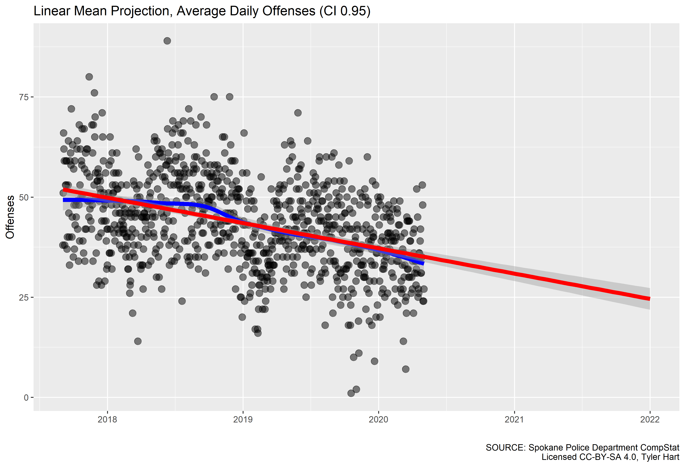
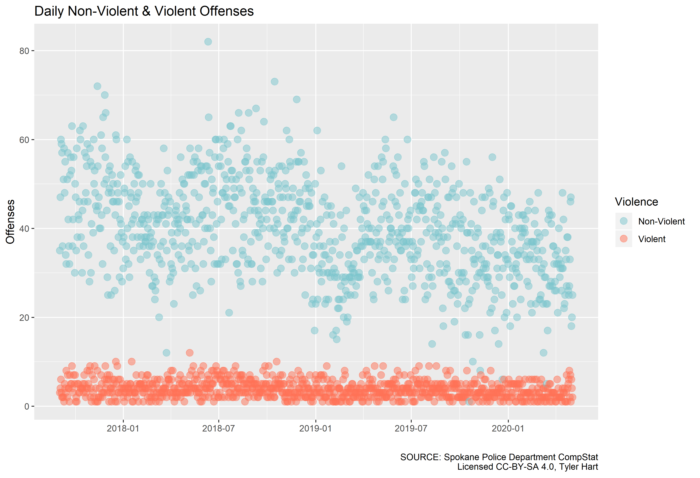
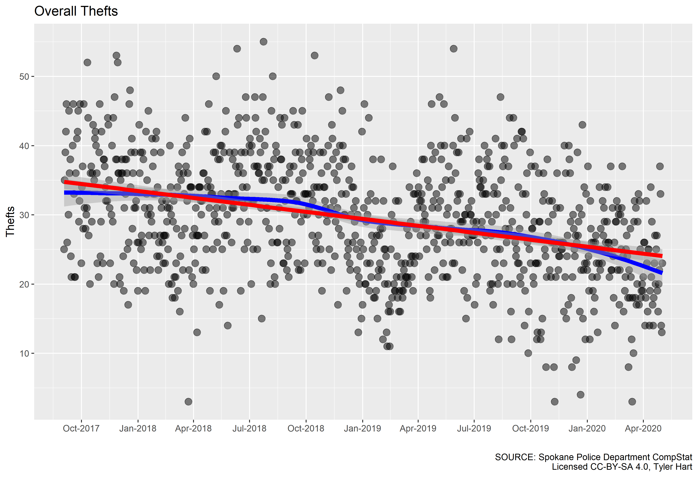
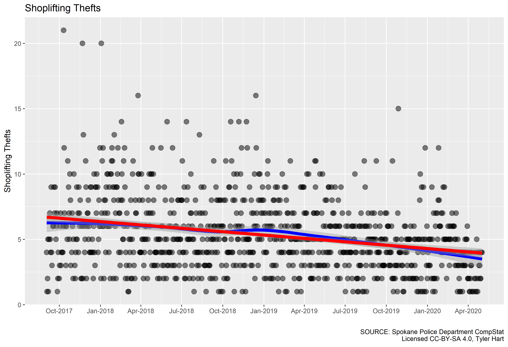
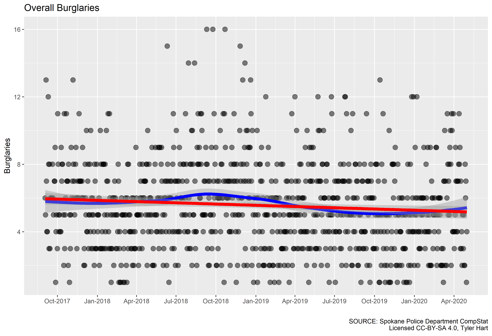
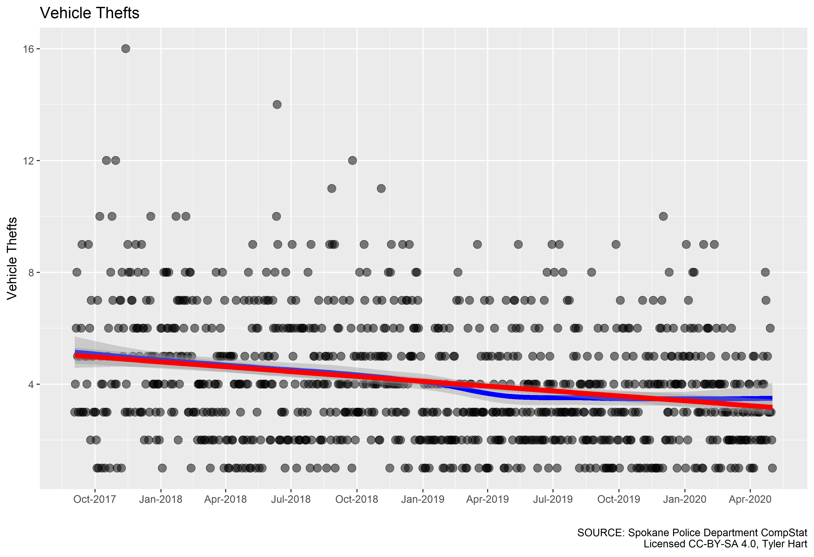
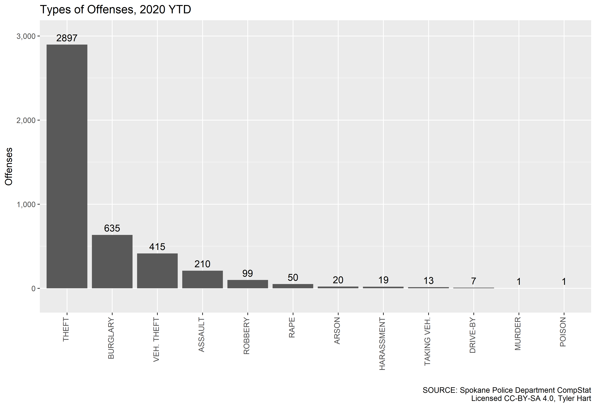
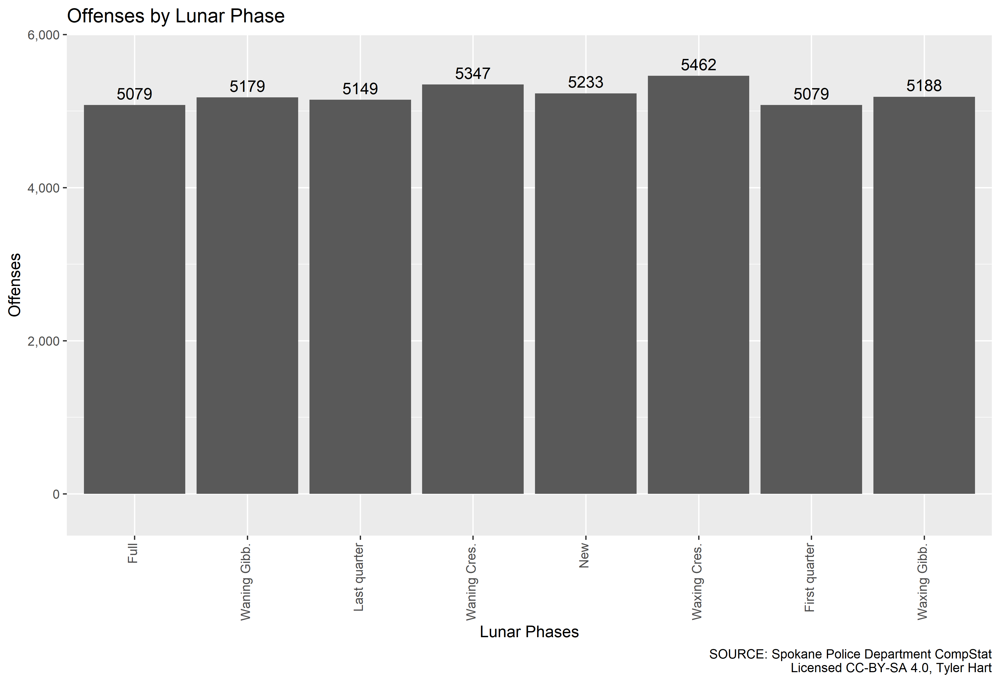

# CompStat Weekly Watch

Spokane Crime Analysis Project (CAP) is dedicated to discovering, analyzing, and visualizing crime data in Spokane, WA. Informed residents can make better decisions about where to live, raise families, work, and play in our wonderful city with up-to-date information on crime. With data in-hand, residents can engage actively and factually with local leaders and law enforcement. Using Computer Statistics (CompStat) [data provided by Spokane Police Department (SPD)](https://my.spokanecity.org/police/prevention/compstat/) we're able to analyze crime that has already happened, discover trends in the data, and make predictions.

Currently, the SPD makes weekly CompStat reports available each Monday. Reports cover reported crime for the prior week in PDF format, broken down by policing districts. We crawl the PDF files, extract data, and transform it into a format useful for analysis.

1. [Data Limitations](#data-limitations)
1. [Overall Statistics](#overall-statistics)
1. [Police District Statistics](#police-district-statistics)
1. [Types of Offenses](#types-of-offenses)
1. [Lunar Phases](#lunar-phases)

## Data Limitations

There are limitations to the analysis that's possible using CompStat data provided by the city. While detailed information about Spokane crime does eventually get reported in the [FBI's NBIRS program](https://crime-data-explorer.fr.cloud.gov/downloads-and-docs), there is often a year's lag or more before the public can download it. For example, 2018's data was made available in September 2019. As of February 2020, only data from 2018 is available. It will likely be summer of 2020 before 2019's data can be downloaded and analyzed. In the meantime, we only have the less-detailed CompStat data to work with. More in-depth analysis of the detailed FBI data will become a separate project.

In the SPD's CompStat data, locations of sexual assault offenses are not included in order to protect the victim's privacy. While we know how many sexual assaults are reported and the general policing district that they occurred, it's not possible to correlate that type of assault with specific locations. When locations are included in weekly CompStat reports, they are sometimes documented only as an intersection of two roads, with no street numbers or direction. If an address is included in CompStat data, the street number is rounded - a robbery at "1215 E. Main Street" may become "1200 E. Main Street". Sometimes low-numbered locations are documented as "0 E. Main Street". This makes density or "heat" mapping difficult, and the resulting graphics unreliable.

It is also well-known that many crimes are not reported to the authorities. This phenomena occurs for a number of reasons depending on the community - social pressures, negative law enforcement encounters in the past, prior criminal history of potential reporters, etc. It would be naive to think that all crime committed in Spokane is reported and subsequently documented in the CompStat reports. Assumptions about the percentage of crimes that go unreported depend on complex, interconnected variables that change over time. For that reason, this project only focuses on analysis and reporting with the data at-hand, without making assumptions about unreported crime.

Spokane's reporting of crime data has also undergone multiple transformations in the last decade. CompStat data is available on the SpokaneCity.org portal from 2019 all the way back to 2015. On October 4, 2016 the SPD moved from one crime reporting standard ([UCR](https://www.ucrdatatool.gov/)) to another ([NIBRS](https://www.fbi.gov/services/cjis/ucr/nibrs)). Current CompStat reports state on the first page about the switchover date,

> Numbers on CompStat reports prior to this date should not be used as a comparison to those on this report.

Unfortunately, we're not able to make true "apples-to-apples" comparisons across the full timespan of availalble CompStat crime data. Some years also have missing weeks of reports, and it's unclear if that data will ever be available.

## Overall Statistics

Looking at overall statistics gives us a good starting point from which to explore crime over time and specific types of offenses. From September 12, 2017 onward we see an overall downward trend in reported crime:

The trend is projected to continue downward overall through 2020:

The majority of crime in Spokane is non-violent, though assaults, robbery, and murder do occur with some regularity:

Of the non-violent crimes, thefts are the most common. This includes shoplifting, burglary (residential and commercial), and motor vehicle thefts:

## Police District Statistics

The city is divided among eight policing districts, with four (P1, P2, P3, P4) in the "North Police Service Area" and the other four (P5, P6, P7, P8) in the "South". Geographically, the north and south service areas are separated by the Spokane River. In CompStat reports some offenses are noted as occurring in an "OTH" district with no amplifying information given. Periodically an offense will also be listed with no district at all in the weekly reports, and those are shown here as "UNK". Districts designated "SPA", "SPB", "SPC", and "SPD" had been used at one point, but no information is given in the CompStat reports indicating what areas these designations represented.

So far in 2020, most crime occurred in districts P1, P2, P3, and P4 - all north of the Spokane River. Districts P4 and P3 are both located north of the river and east of Division, and have the highest overall counts. Districts P1-P4 have the highest overall counts of reported crimes from September 2017 onward.

Here's the same district breakdown from 2017 to 2020:

We can also look at the same information, but split up between violent and non-violent crime:

## Types of Offenses

General theft (or larceny), burglary, shoplifting, and theft of motor vehicles continue to be top reported crimes so far in 2020:

This follows the trend that's been recorded since mid-2017:

## Month-Over-Month Statistics

While looking at data week-over-week is often not useful due to how "jumpy" crime statistics can be, month-over-month data can tell a story. Any field in the tables with "NA" value indicates that data either was not or is not yet available.

1. [Non-Violent Crime](#non-violent-crime)
1. [Violent Crime](#violent-crime)

### Non-Violent Crime

Most crime in Spokane is "non-violent", including theft and burglary.

### Violent Crime

Violent crime includes assault, sexual assault, robbery, intimidation with a weapon, and carjacking:

## Lunar Phases

There is still much speculation about the moon's effect on people's behavior, despite numerous studies that point to the contrary. We've visualized the number of offenses per phase of the moon:

There is no significant difference in the amount of offenses between lunar phases.
